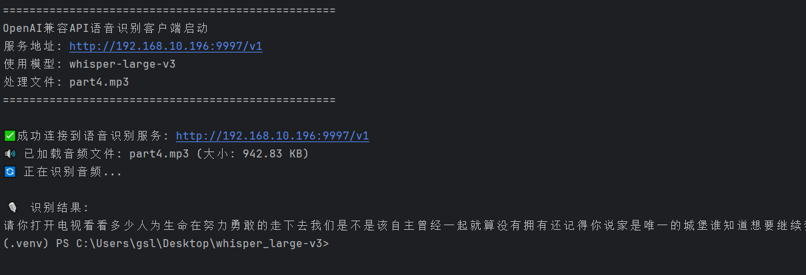
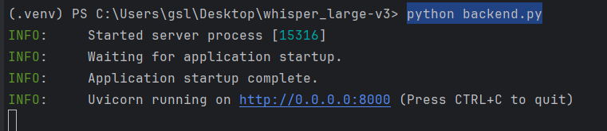
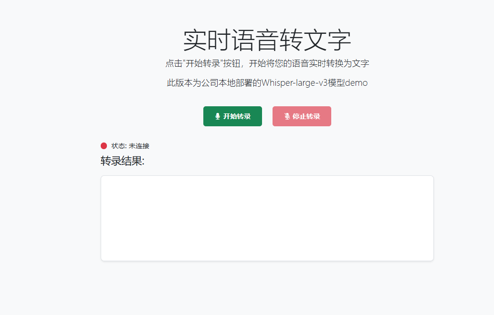
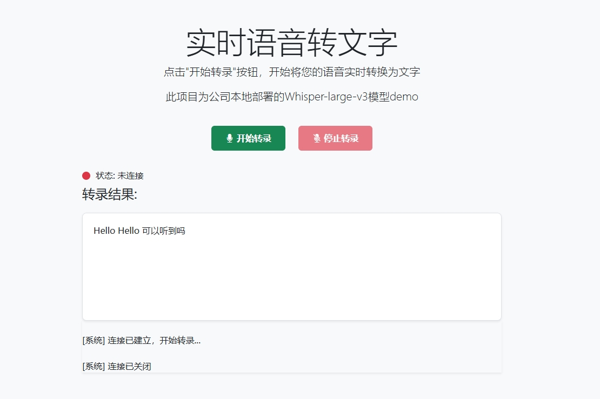

此项目本为用Xinference本地部署的Whisper-large-v3模型调用案例，上传文件和实时识别

1.项目启动
安装依赖
pip install -r requirements.txt

2.文件介绍
2.1 音频文件转文字功能（音频文件转文字返回的是繁体字需要引入python包处理返回结果，实时转文字出来的就是简体中文）
[whisper_large.py](whisper_large.py) 

启动项等待一会目可以看到识别结果
python whisper_large.py

2.2 语音实时转文字
启动web服务
python backend.py

看到下面输出启动成功

访问
http://localhost:8000/index.html

如果遇到页面样式未加载出来需要挂VPN访问国外的静态资源文件

看到下面页面

点击录音看到结果

